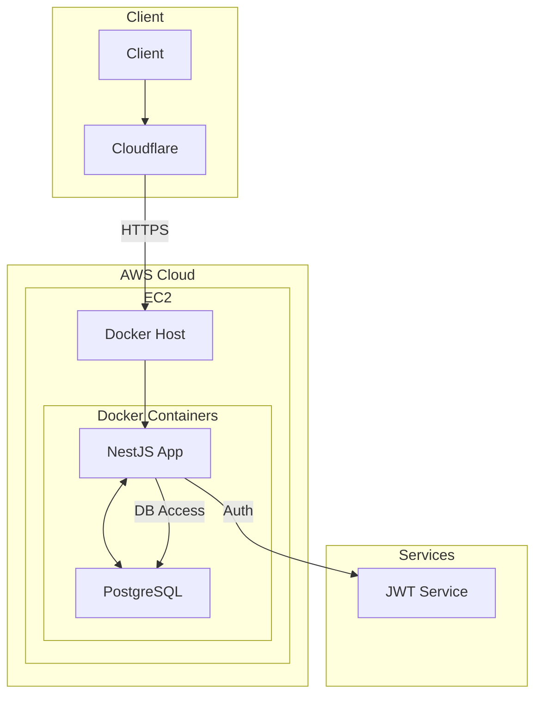
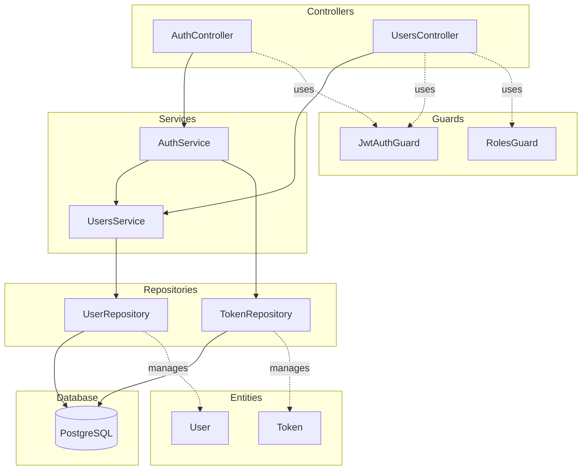

# User Management System

## 프로젝트 개요
사용자 관리 시스템의 백엔드 API를 개발하고 AWS 클라우드에 배포하는 프로젝트입니다.

## 기술 스택
- NestJS (TypeScript)
- TypeORM
- PostgreSQL
- Docker & Docker Compose
- AWS (EC2)
- Terraform
- Cloudflare

## 주요 기능
- 사용자 인증 (JWT 기반)
- 사용자 CRUD 작업
- RBAC (Role Based Access Control)
- Refresh Token 관리

## API 엔드포인트
```
POST /auth/login    # 사용자 로그인 및 JWT 발급
POST /auth/logout   # 사용자 로그아웃
POST /users         # 사용자 정보 생성 (로그인 필요)
GET /users          # 사용자 목록 조회 (관리자만 접근 가능)
GET /users/:id      # 특정 사용자 조회 (로그인 필요)
PUT /users/:id      # 사용자 정보 수정 (본인만 가능)
DELETE /users/:id   # 사용자 삭제 (본인만 가능)
```

## 인프라 구성
해당 부분은 미구현 상태이며, 구현 시 아래와 같은 구조로 진행
- AWS EC2 (t2.micro)
- Cloudflare (DNS, SSL, DDoS 보호)
- Docker로 애플리케이션 컨테이너화
- Docker Compose로 PostgreSQL 관리

## 시스템 아키텍쳐 다이어그램



## 서비스 아키텍쳐 다이어그램


## 설치 및 실행방법
0. 사전 세팅
```
brew install pre-commit
```

1. 저장소 클론
```bash
git clone [repository-url]
```

2. 환경변수 설정
```bash
cp .env.example .env
# .env 파일 수정
```

3. 개발 환경 실행
```bash
npm install
npm run start:dev
```

## 테스트
```bash
# 단위 테스트 실행
npm run test

# 테스트 커버리지 확인
npm run test:cov
```

## Devops
- biome를 활용한 코드 포맷팅 및 pre-commit을 활용한 훅 설정
- GitHub Actions를 통한 자동화된 테스트 및 빌드

## 미구현 및 보강해야할 사항
- in-memory DB(pg-mem)을 사용한 자동화된 테스트
- 인프라 구성 (Terraform)
  - 개발/프로덕션 환경 분리 구축
  - HTTPS 적용